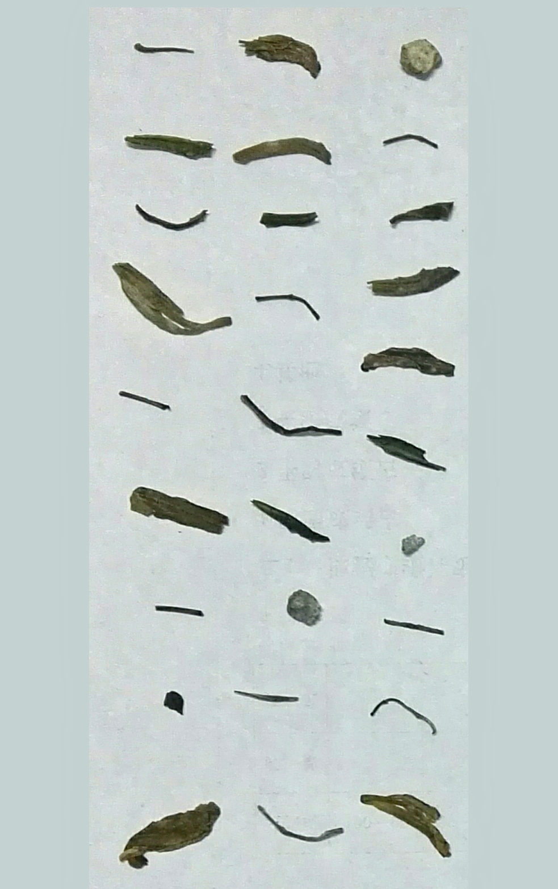
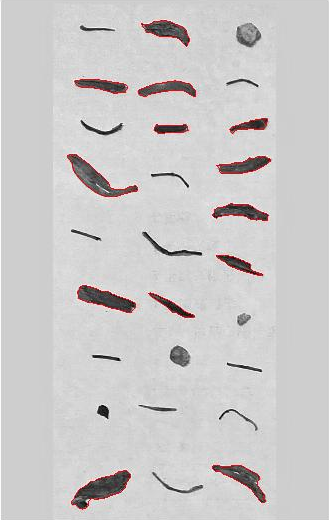
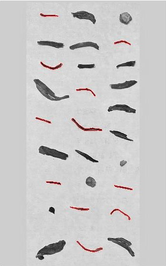
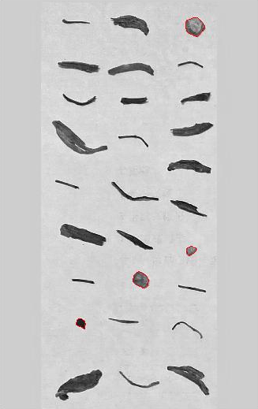

# Image Digital Processing for Sorters

###### Xu Ran1, Jiang Rui2,Zhai Huaqiong1, Xu Jun1, Liu Hongda3

*1 Shool of Information & Computer, Anhui Agricultural University*

*2 Shool of Engineering, Anhui Agricultural University*

*3 Shool of Science, Anhui Agricultural University*

This project proposed an algorithm based on image digital processing for sorters. Firstly, some geometry features are filtered by Correlation based on Feature Selection (CFS). Then design a Support vector machine (SVM) classifier base on the above features to recognize tea and impurity from complex background image.

Research shows that using the radius of the maximum inscribed circle, circularity, area, the radius of the minimum circumcircle, perimeter, the area of the minimum bounding rectangle and the sphericity as geometric features, along with using linear kernel function SVM classifier can make the recognition rate up to 96% for our datasets. The research in this project can provide technical support to the design and development of new tea sorters.

## Procedure

- Preprocessing
- Feature Extracting and Evaluation
- SVM Classifier 
- Test

## Correlation based on Feature Selection，CFS

CFS is a classic filter mode feature selection method that considers the correlation between features and class labels, and the correlation between categories and categories. The stronger the correlation between the feature and the class label, the stronger the predictive ability of the feature; the stronger the correlation between the category and the category, indicating that the redundancy of the feature is greater.

## Support Vector Machine，SVM

In this study, there are three types of tea, tea stems and impurities to be classified. A large number of known categories of tea, tea steams and impurities were collected as training samples and their shape characteristics were extracted for training SVM classifier. After training, the test images are extracted features, and classify the tea, steams and impurities by the SVM classifier.

## Example

- (a) The test image

- (b) Mark the tea in the test image

- (c) Mark the stems in the test image

- (d) Mark the impurities in the test image

## Acknowledgments

Project Fund: 

- National Natural Science Foundation of China (11202208)

- Anhui Agricultural University Introduction and Stabilization Talent Project (yj2015-32)

- Anhui University Student Innovation Training Program (AH201510364053)

